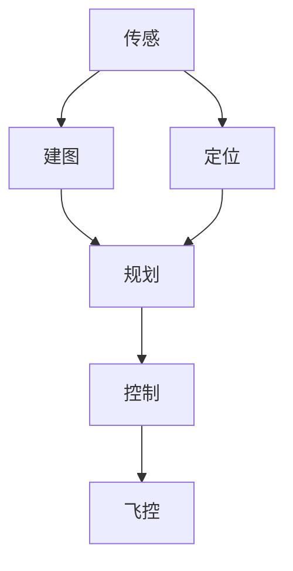

 自主无人机是一个感知-规划-控制的闭环系统

 底层飞控只控制推力和姿态，上层电脑中的控制器计算期望的推力和姿态
 参考的控制器开源代码链接： https://github.com/HKUST-Aerial-Robotics/Teach-Repeat-Replan/tree/experiment/onboard_computer/controller

## 四旋翼无人机动力学
![[PixPin_2026-09-23_20-06-58.png]]

观测器(Observer)：观测线性系统中一些不可直接测量的量
