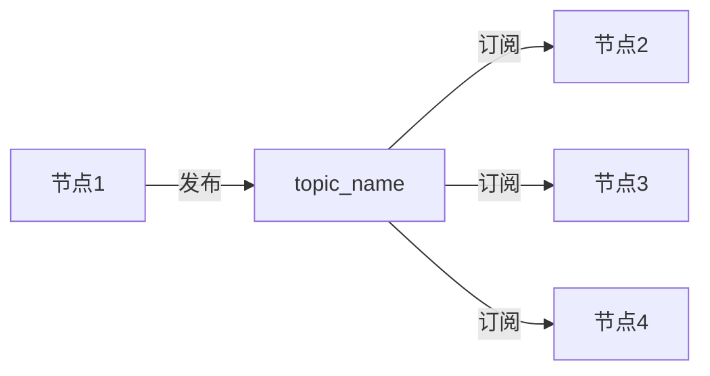
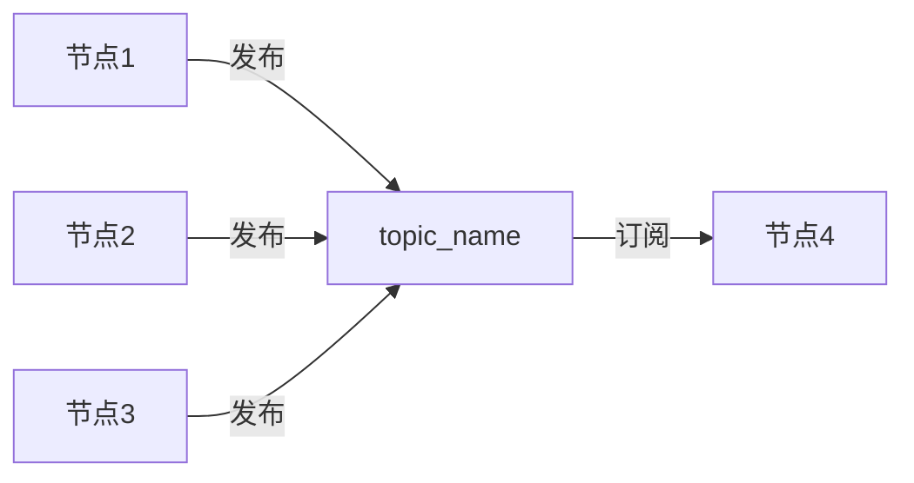
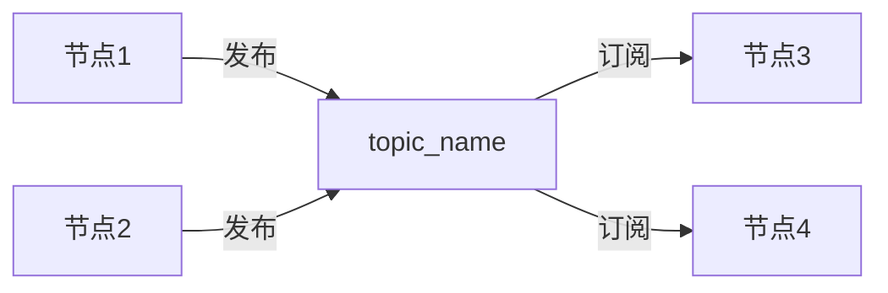
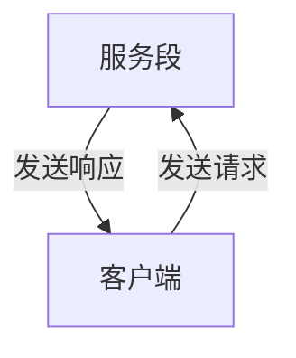

# 话题
## 订阅发布模型
一个节点发布数据到，某个话题上，另外一个节点就可以通过订阅话题拿到数据


还可以一对n，n对1，n对n进行通信

1对n


n对1


n对n


还有就是ROS2节点可以订阅本身发布的话题


## 消息接口

定义好消息接口后，ROS2会根据消息接口内容生成不同语言的接口类，在不同编程语言中调用相同的类即可实现无感的消息序列化和反序列化。

**同一个话题，所有的发布者和接收者必须使用相同消息接口**。

## ROS2话题工具
### 1.GUI工具rqt_graph

可以通过该工具查看节点与节点间的关系

demo示例
```bash
ros2 run demo_node_py listener
ros2 run demo_node_cpp talker
rqt_graph
```
![[Pasted image 20260127104903.png]]

### 2.CLI工具
ROS2也支持很多强大的topic指令，可以用下面的指令查看

```bash
ros2 topic -h
```

1. `ros2 topic list`返回系统中当前活动的所有主题的列表
2. `ros2 topic list -t`增加消息类型
3. `ros2 topic echo <topic_name>打印实时话题内容
4. `ros2 topic info <topic_name>`查看主题信息
5. `ros2 interface show <message_type>` 查看消息类型
6. `ros2 topic pub <topic_name> <message_type> 'data:"XXX"'`手动发布命令

命令
	```bash
	ros2 topic pub /chatter std_msgs/msg/String 'data:"123"'
	```
![[Pasted image 20260127111237.png]]

## 话题RCLCPP实现
### 创建节点
创建一个控制节点和被控节点

控制节点创建一个话题发布者，发送控制命令（commad）话题，接口类型为字符串（string)，命令有前进、后退、左转、右转、停止

被控节点创建一个订阅者，订阅控制命令，收到控制命令后根据控制命令打印对应速度出来

以此输入下面的命令创建`chapt3_ws`工作空间、`example_topic_rclcpp`功能包和`topic_publisher_01.cpp`

```bash
 mkdir -p chapt3/chapt3_ws/src
 cd chapt3/chapt3_ws/src/
 ros2 pkg create example_topic_rclcpp --build-type ament_cmake --dependencies rclcpp
 touch example_topic_rclcpp/src/topic_publishe_01.cpp
```

接着采用面对对象方式写一个最简单的节点

```cpp
#include "rclcpp/rclcpp.hpp"

  

class TopicPublisher01 : public rclcpp::Node

{

public:

TopicPublisher01(std::string name):Node(name)

{

RCLCPP_INFO(this->get_logger(), "Node %s has been started.", name.c_str());

}

private:

};

  

int main(int argc, char **argv)

{

rclcpp::init(argc, argv);

  

auto node = std::make_shared<TopicPublisher01>("topic_publisher_01");

  

rclcpp::spin(node);

rclcpp::shutdown();

return 0;

}
```

修改`CMakeLists.txt`

```cmake
add_executable(topic_publisher_01 src/topic_publisher_01.cpp)

ament_target_dependencies(topic_publisher_01 rclcpp)

install(TARGETS
  topic_publisher_01
  DESTINATION lib/${PROJECT_NAME}
  )
```

编译测试

```bash
 colcon build --packages-select example_topic_rclcpp
 source install/setup.bash
 ros2 run example_topic_rclcpp topic_publisher_01
```

### 编写发布者
#### 学习使用API文档
创建发布者只需调用`node`的成员函数`create_publisher`并传入对应参数即可

我们至少需要传入消息类型(msgT)、话题名称(topic_name)和服务指令(qos)

#### 导入消息接口
消息接口是ROS2通信时必须的一部分，通过消息接口ROS2才能完成消息的序列化和反序列化。

`ament_cmake`导入消息接口的步骤：
1. 在`CMakeLists.txt`中导入，具体是先`find_packages`在`ament_target_dependencies`
2. 在`packages.xml`中导入，具体是添加`depend`标签并将消息接口写入
3. 在代码中导入，C++中是`#include "消息功能包/xxx/xxx.hpp"

以此做完三步后文件内容如下：
CMakeLists.txt
```cmake
find_package(rclcpp REQUIRED)
find_package(std_msgs REQUIRED)

add_executable(topic_publisher_01 src/topic_publisher_01.cpp)
ament_target_dependencies(topic_publisher_01 rclcpp std_msgs)
```
package.xml
```xml
<buildtool_depend>ament_cmake</buildtool_depend>

<depend>rclcpp</depend>
<depend>std_msgs</depend>

<test_depend>ament_lint_auto</test_depend>
<test_depend>ament_lint_common</test_depend>
```
topic_publisher_01.cpp
```cpp
#include "std_msgs/msg/string.hpp"
```

#### 创建发布者
根据文档，我们需要提供消息接口、话题名称和服务质量QoS

- 消息接口我们已经导入了，是`std_msg/msg/string.h`
- 话题名称(topic_name)，我们用`control_commad`
- QoS支持直接指定一个数字，这个狮子对应的是`KeepLast`队列长度。一般设置成10，即如果一次性有100条消息，默认保留最新10个，其余的都扔掉

编写发布者的代码如下：
```cpp
#include "rclcpp/rclcpp.hpp"

#include "std_msgs/msg/string.hpp"

class TopicPublisher01 : public rclcpp::Node

{

public:

TopicPublisher01(std::string name):Node(name)

{

RCLCPP_INFO(this->get_logger(), "Node %s has been started.", name.c_str());

// 创建发布者

command_publisher_ = this->create_publisher<std_msgs::msg::String>("command", 10);

}

private:

// 声明话题发布者

rclcpp::Publisher<std_msgs::msg::String>::SharedPtr command_publisher_;

};

  

int main(int argc, char **argv)

{

rclcpp::init(argc, argv);

  

auto node = std::make_shared<TopicPublisher01>("topic_publisher_01");

rclcpp::spin(node);

rclcpp::shutdown();

return 0;

}
```

#### 使用定时器定时发布数据
##### 查看定时器API

我们需要通过ROS2中的定时器来设置指定的周期调用回调函数，在回调函数里实现发布数据功能

- period，回调周期
- callback，回调函数
- group，调用回调函数所在的回调组，默认为nullptr

代码如下：
```cpp
class TopicPublisher01 : public rclcpp::Node

{

public:

TopicPublisher01(std::string name):Node(name)

{

RCLCPP_INFO(this->get_logger(), "Node %s has been started.", name.c_str());

// 创建发布者

command_publisher_ = this->create_publisher<std_msgs::msg::String>("command", 10);

// 创建定时器，500ms回调一次

timer_ = this->create_wall_timer(std::chrono::milliseconds(500), std::bind(&TopicPublisher01::timer_callback, this));

}

private:

void timer_callback()

{

std_msgs::msg::String message;

// 设置消息内容

message.data = "forward";

// 打印日志

RCLCPP_INFO(this->get_logger(), "Publishing: '%s'", message.data.c_str());

// 发布消息

command_publisher_->publish(message);

}

// 声明话题发布者

rclcpp::Publisher<std_msgs::msg::String>::SharedPtr command_publisher_;

// 声明定时器指针

rclcpp::TimerBase::SharedPtr timer_;

};
```

运行结果

![[Pasted image 20260127231843.png]]

### 编写订阅者

我们可以用命令行看到数据原因是CLI创建了一个订阅这来订阅`/command`指令。接下来手动创建一个节点订阅并处理数据。


#### 创建订阅节点

```bash
cd chapt3_ws/src/example_topic_rclcpp
touch src/topic_subscribe_01.cpp
```

编写代码
```cpp
 #include "rclcpp/rclcpp.hpp"

  

class TopicSubscribe01 : public rclcpp::Node

{

public:

TopicSubscribe01(std::string name) : Node(name)

{

// 构造函数，有一个参数为节点名称

RCLCPP_INFO(this->get_logger(), "Node '%s' has been started.", name.c_str());

}

private:

//声明节点

  

};

  

int main(int argc, char **argv)

{

rclcpp::init(argc, argv);

// 创建对应节点的共享指针对象

auto node = std::make_shared<TopicSubscribe01>("topic_subscriber_01");

// 运行节点，并检测退出信号

rclcpp::spin(node);

rclcpp::shutdown();

return 0;

}
```

然后编译 source环境变量 运行
```bash
colcon build --packages-select example_topic_rclcpp
source install/setup.bash
ros2 run example_topic_rclcpp topic_subscribe_01
```


### 订阅发布测试

```
cd chapt3/chapt3_ws/
source install/setup.bash
ros2 run example_topic_rclcpp topic_subscribe_01
```

```
cd chapt3/chapt3_ws/
source install/setup.bash
ros2 run example_topic_rclcpp topic_publisher_01
```

## 话题RCLPY实现

创建功能包

```bash
cd chapt3/chapt3_ws/src/
ros2 pkg create example_topic_rclpy --build-type ament_python --dependencies rclpy
```

创建节点文件

```bash
cd example_topic_rclpy/example_topic_rclpy
touch topic_publisher_01.py
touch topic_subscriber_01.py
```

采用类的形式编写代码
订阅者代码
```python
#!/usr/bin/env python3

import rclpy

from rclpy.node import Node

from std_msgs.msg import String

  

class NodeSubscriber02(Node):

	def __init__(self, name):

		super().__init__(name)

		self.get_logger().info("Node Subscriber02 has been started")

		self.command_subscriber = self.create_subscription(String, "command", self.command_callback, 10)

  

	def command_callback(self, msg):

		speed = 0.0

		if msg.data == "backup":

		speed = -0.2

		self.get_logger().info(f'Received command: {msg.data}, setting speed to {speed}')

  

def main(args=None):

	rclpy.init(args=args)

	node = NodeSubscriber02("topic_subscriber_02")

	rclpy.spin(node)

	rclpy.shutdown()
```
发布者代码
```python
#!/usr/bin/env python3

import rclpy

from rclpy.node import Node

from std_msgs.msg import String

  

class NodePublisher02(Node):

	def __init__(self, name):

		super().__init__(name)

		self.get_logger().info("Node Publisher02 has been started.")

		self.command_publisher_ = self.create_publisher(String, "command", 10)

		self.timer = self.create_timer(0.5, self.timer_callback)

  

	def timer_callback(self):

		msg = String()

		msg.data = 'backup'

		self.command_publisher_.publish(msg)

		self.get_logger().info(f'Published command: {msg.data}')

  
  

def main(args = None):

	rclpy.init(args=args)

	node = NodePublisher02("topic_publisher_02")

	rclpy.spin(node)

	rclpy.shutdown()
```

在setup.py中修改
```python
entry_points={

	'console_scripts': [

	"topic_publisher_02 = example_topic_rclpy.topic_publisher_02:main",

	"topic_subscriber_02 = example_topic_rclpy.topic_subscriber_02:main"

	],

},
```

# 服务
## 服务通信

服务分为客户端和服务端，客户端发送请求给服务端，服务端根据客户端的请求做一些处理，然后返回给客户端



服务-客户端模型也称做请求-响应模型

注意事项：

- 同一个服务（名称相同）有且只能有一个节点来提供
- 同一个服务可以被多个客户端调用

![][https://fishros.com/d2lros2/humble/chapt3/get_started/4.ROS2%E6%9C%8D%E5%8A%A1%E5%85%A5%E9%97%A8/imgs/Service-SingleServiceClient.gif]
![][https://fishros.com/d2lros2/humble/chapt3/get_started/4.ROS2%E6%9C%8D%E5%8A%A1%E5%85%A5%E9%97%A8/imgs/Service-MultipleServiceClient.gif]

## 服务初体验
### 启动服务端
```bash
yummy@yummy-honor-ubuntu:~/d2lros2/chapter2/colcon_test_ws$ ros2 run examples_rclpy_minimal_service service

```
### 使用命令查看服务列表
```bash
ros2 service list
```

![[Pasted image 20260202112451.png]]

### 手动调用服务

```bash
ros2 service call /add_two_ints example_interfaces/srv/AddTwoInts "{a: 5, b: 10}"
```

![[Pasted image 20260202112643.png]]

## ROS2服务常用命令

### 查看服务列表

```bash
ros2 service list
```

### 手动调用服务

```bash
ros2 service call /add_two_ints example_interfaces/srv/AddTwoInts "{a: 5,b: 10}"
```

如果不加后面的参数

```bash
ros2 service call /add_two_ints example_interfaces/srv/AddTwoInts
```

默认返回为0+0的值

![[Pasted image 20260202113242.png]]
### 查看服务接口类型

```bash
ros2 service type /add_two_ints
```

### 查找使用某一接口的服务

该命令看起来和查看接口类型相反 

```bash
ros2 service find example_interface/srv/AddTwoInts 
```

## 服务之RCLCPP实现

实现两数相加的服务端和客户端

### 创建功能包和节点 

```bash
cd chapt3/chapt3_ws/src
ros2 pkg create example_service_rclcpp --build-type ament_cmake --dependencies rclcpp
touch example_service_rclcpp/src/service_server_01.cpp
touch example_service_rclcpp/src/service_client_01.cpp
```

编写两个最简单的节点：

`service_client_01.cpp`:

```cpp
#include "rclcpp/rclcpp.hpp"

  

class ServiceClientNode : public rclcpp::Node

{

public:

ServiceClientNode(std::string name) : Node(name)

{

RCLCPP_INFO(this->get_logger(), "%s Node has been started.", name.c_str());

}

private:

};

  

int main(int argc, char **argv)

{

rclcpp::init(argc, argv);

auto node = std::make_shared<ServiceClientNode>("service_client_01");

rclcpp::spin(node);

rclcpp::shutdown();

return 0;

}
```

`service_server_01.cpp`:

```cpp
#include "rclcpp/rclcpp.hpp"

  

class ServiceServerNode : public rclcpp::Node

{

public:

ServiceServerNode(std::string name) : Node(name)

{

RCLCPP_INFO(this->get_logger(), "%s Node has been started.", name.c_str());

}

private:

};

  

int main(int argc, char **argv)

{

rclcpp::init(argc, argv);

auto node = std::make_shared<ServiceServerNode>("service_server_01");

rclcpp::spin(node);

rclcpp::shutdown();

return 0;

}
```

修改CMakeLists.txt

```cmake
add_executable(service_client_01 src/service_client_01.cpp)

ament_target_dependencies(service_client_01 rclcpp)

  

add_executable(service_server_01 src/service_server_01.cpp)

ament_target_dependencies(service_server_01 rclcpp)

  

install(TARGETS

service_client_01

service_server_01

DESTINATION lib/${PROJECT_NAME}

)
```

编译运行

### 服务端实现
#### 导入接口

两数相加需要利用ROS2自带的`example_interface`接口，使用命令行可以查看这个接口的定义

```bash
ros2 interface show example_interfaces/srv/AddTwoInts
```
结果

```bash
int64 a
int64 b
---
int64 sum
```

导入接口的三个步骤
> `ament_cmake`类型功能包导入消息接口分为三步
> 1. 在`CMakeLists.txt`中导入，具体是先`find_packages`再`ament_target_dependences`
> 2. 在`packages.xml`中导入，具体是添加`depend`标签并将消息接口写入
> 3. 在代码中导入，C++中是`#incldue "消息功能包/xxx/xxx.hpp"`

根据步骤修改

`CMakeLists.txt`

```
# 这里我们一次性把服务端和客户端对example_interfaces的依赖都加上
find_package(example_interfaces REQUIRED)

add_executable(service_client_01 src/service_client_01.cpp)
ament_target_dependencies(service_client_01 rclcpp example_interfaces)

add_executable(service_server_01 src/service_server_01.cpp)
ament_target_dependencies(service_server_01 rclcpp example_interfaces)
```

`packages.xml`

```xml
<depend>example_interfaces</depend>
```

代码

```cpp
#include "example_interfaces/srv/add_two_ints.hpp"
```

#### 编写代码

```cpp
#include "rclcpp/rclcpp.hpp"

#include "example_interfaces/srv/add_two_ints.hpp"

  

class ServiceServer01 : public rclcpp::Node

{

public:

ServiceServer01(std::string name) : Node(name)

{

RCLCPP_INFO(this->get_logger(), "%s Node has been started.", name.c_str());

// 创建服务

add_ints_server_ = this->create_service<example_interfaces::srv::AddTwoInts>("add_two_ints", std::bind(&ServiceServer01::handle_add_two_ints, this, std::placeholders::_1, std::placeholders::_2));

}

private:

// 声明一个服务

rclcpp::Service<example_interfaces::srv::AddTwoInts>::SharedPtr add_ints_server_;

// 收到处理的请求回调函数

void handle_add_two_ints(const std::shared_ptr<example_interfaces::srv::AddTwoInts::Request> request, std::shared_ptr<example_interfaces::srv::AddTwoInts::Response> response)

{

RCLCPP_INFO(this->get_logger(), "Received request: a=%ld, b=%ld", request->a, request->b);

response->sum = request->a + request->b;

RCLCPP_INFO(this->get_logger(), "Sending response: sum=%ld", response->sum);

}

};

  

int main(int argc, char **argv)

{

rclcpp::init(argc, argv);

auto node = std::make_shared<ServiceServer01>("service_server_01");

rclcpp::spin(node);

rclcpp::shutdown();

return 0;

}
```

> `std::bind`函数用于将一个函数（特别是类的成员函数）和它的参数绑定在一起，生成一个新的可调用的对象（functor）。
> 在ROS2中，因为服务的回调函数需要作为参数传递给`create_service`，而类的非静态成员函数包含隐含的`this`指针，不能直接传递，所以必须使用`std::bind`进行封装。
> 
#### 测试

```bash
cd chapt3_ws/
colcon build --packages-select example_service_rclcpp
source install/setup.bash
ros2 run example_service_rclcpp service_server_01
```

```bash
ros2 service list
# 使用命令行进行调用
ros2 service call /add_two_ints_srv example_interfaces/srv/AddTwoInts "{a: 5,b: 10}"
```

### 客户端实现
#### API接口

`create_client`创建客户端API [地址](https://docs.ros2.org/latest/api/rclcpp/classrclcpp_1_1Node.html#aed42f345ae1de3a1979d5a8076127199)

`async_send_request`发送请求API [地址](https://docs.ros2.org/latest/api/rclcpp/classrclcpp_1_1Client.html#a62e48edd618bcb73538bfdc3ee3d5e63)

`wait_for_serivce` 等待服务上线 

#### 代码

```cpp
#include "rclcpp/rclcpp.hpp"

#include "example_interfaces/srv/add_two_ints.hpp"

  

class ServiceClientNode : public rclcpp::Node

{

public:

ServiceClientNode(std::string name) : Node(name)

{

RCLCPP_INFO(this->get_logger(), "%s Node has been started.", name.c_str());

// 创建客户端

add_ints_client_ = this->create_client<example_interfaces::srv::AddTwoInts>("add_two_ints");

}

  

void send_request(int a, int b)

{

RCLCPP_INFO(this->get_logger(), "Calculating %d + %d", a, b);

while(!add_ints_client_->wait_for_service(std::chrono::seconds(1)))

{

if(!rclcpp::ok())

{

RCLCPP_INFO(this->get_logger(), "interrupted while waiting for the service. Exiting.");

return;

}

RCLCPP_INFO(this->get_logger(), "Waiting for the service to be available...");

}

auto request = std::make_shared<example_interfaces::srv::AddTwoInts::Request>();

request->a = a;

request->b = b;

  

add_ints_client_->async_send_request(request, std::bind(&ServiceClientNode::result_callback_, this, std::placeholders::_1));

}

private:

// 声明客户端

rclcpp::Client<example_interfaces::srv::AddTwoInts>::SharedPtr add_ints_client_;

  

void result_callback_(rclcpp::Client<example_interfaces::srv::AddTwoInts>::SharedFuture result_future)

{

auto response = result_future.get();

RCLCPP_INFO(this->get_logger(), "Result of add_two_ints: %ld", response->sum);

}

};

  

int main(int argc, char **argv)

{

rclcpp::init(argc, argv);

auto node = std::make_shared<ServiceClientNode>("service_client_01");

node->send_request(3, 5);

rclcpp::spin(node);

rclcpp::shutdown();

return 0;

}
```

## 服务之python实现

### 创建功能包和节点

简化指令
```bash
cd chapt3/chapt3_ws/src
ros2 pkg create example_service_rclpy --build-type ament_python --dependencies rclpy example_interfaces --node-name service_server_02
```

`--node-name service_server_02`会帮我们创建好节点和添加执行文件

但只支持一个节点文件，所以还需要我们手动创建一个

```bash
cd example_service_rclpy/example_service_rclpy/
touch service_client_02.py
```

修改`setup.py`

```python
    entry_points={
        'console_scripts': [
            "service_client_02 = example_service_rclpy.service_client_02:main",
            "service_server_02 = example_service_rclpy.service_server_02:main"
        ],
    },
```

用面对对象编写代码

client:

```python
#!/usr/bin/env python3

import rclpy

from rclpy.node import Node

from example_interfaces.srv import AddTwoInts

  

class ServiceClient02(Node):

	def __init__(self, name):

		super().__init__(name)

		self.get_logger().info("%s has been started." % name)

		self.client_ = self.create_client(AddTwoInts, "add_two_ints_srv")

  
	
	def result_callback_(self, result_future):

		response = result_future.result()

		self.get_logger().info(f"Result of add_two_ints: {response.sum}")

  

	def send_request(self, a, b):

		while rclpy.ok() and self.client_.wait_for_service(timeout_sec=1.0) == False:

			self.get_logger().info("service not available, waiting again...")

		request = AddTwoInts.Request()
		
		request.a = a

		request.b = b

		self.client_.call_async(request).add_done_callback(self.result_callback_)

  

def main(args=None):

	rclpy.init(args=args)

	node = ServiceClient02("service_client_02")

	node.send_request(3,4)

	rclpy.spin(node)

	rclpy.shutdown()
```

server:

```python
#!/usr/bin/env python3

import rclpy

from rclpy.node import Node

from example_interfaces.srv import AddTwoInts

  

class ServiceServer02(Node):

	def __init__(self, name):

		super().__init__(name)

		self.get_logger().info("%s has been started." % name)

		self.add_ints_server = self.create_service(AddTwoInts, "add_two_ints_srv", self.handle_add_two_ints)

  

	def handle_add_two_ints(self, request, response):

		response.sum = request.a + request.b

		self.get_logger().info("Incoming request: a=%d, b=%d" % (request.a, request.b))

		return response

  

def main(args=None):

	rclpy.init(args=args)

	node = ServiceServer02("service_server_02")

	rclpy.spin(node)

	rclpy.shutdown()
```

# 接口
## 接口简介

接口是一种规范

ROS2中自带了很多接口 ，使用`ros2 interfance package sensor_masgs`可以查看某一个接口包下所有接口

### 接口文件内容

ros2有四种通信方式，除了参数外，其他三种都支持自定义接口，分为：话题接口、服务接口、动作接口

### 接口形式

话题接口格式：`xxx.msg`
```
int64 num
```

服务接口格式：`xxx.srv`
```
int64 a
int64 b
---
int64 num
```

动作接口格式：`xxx.action`
```
int32 order
---
int32[] sequence
---
int32[] partical_sequence
```

### 接口数据类型
根据引用方式不同可以分为基础类型和包装类型两类

基础类型
```
bool
byte
char
float32,float64
int8,uint8
int16,uint16
int32.uint32
int64,uint64
string
```
包装类型:在已有的接口类型上进行包含
```
uint32 id
string image_name
sensor_msgs/Image
```

### 接口如何生成代码
接口文件可以通过ROS2-IDL(Interface Definition Language)转换器将msg、srv、action文件转换为Python和C++的头文件，有了头文件后，我们可以在程序中导入并使用这个消息模块


## 自定义接口
### 场景定义
定义机器人开发中的一个常见场景，我们设计满足要求的服务接口和话题接口

设计两个节点
- 机器人节点，对外提供移动指定距离**服务**，移动完成后**返回**当前位置，同时对外**发布**机器人的**位置和状态**
- 机器人控制节点，通过**服务**控制机器人**移动指定距离**，并实时**获取**当前**位置和状态** 
假设机器人只能在坐标轴上运动，只能前后运动
### 定义接口
服务接口`MoveRobot.srv`
```srv
# 前后移动的距离
float32 distance
---
# 当前的位置
float32 pose 
```

话题接口，采用基础类型`RoboStatus.msg`
```msg
uint32 STATUS_MOVING  = 1
uint32 STATUS_STOP = 1
uint32 status
float32 pose
```

话题接口，混合包装类型`RoboPose.msg`
```
uint32 STATUS_MOVING = 1
uint32 STATUS_STOP = 2
uint32 status 
geometry_msgs/Pose pose
```

> 接口中可以定义默认值和常量
> 默认值：`int32 speed 10`。如果发送者没有发送这个值，接收者会看到10
> 常量：`int32 MAX_SPEED = 100`。定义消息中的常量值


### 创建接口功能包编译接口

创建功能包
```bash
ros2 pkg create example_ros2_interfaces --build-type ament_cmake --dependencies rosidl_default_generators geometry_msgs
```
注意功能包类型必须为`ament_cmake`

依赖`rosidl_default_generators`必须添加，`geometry_msgs`视内容情况添加

接着创建文件夹和文件将文件写入。注意话题接口放到`msg`文件夹下，以`.msg`结尾，服务接口放在`srv`文件夹下,以`srv`结尾

接着修改`CMakeLists.txt`
```cmake
# 添加下面的内容

rosidl_generate_interfaces(${PROJECT_NAME}

"msg/RobotPose.msg"

"msg/RobotStatus.msg"

"srv/MoveRobot.srv"

DEPENDENCIES geometry_msgs

)
```

接着修改`package.xml`
```xml
<depend>rosidl_default_generators</depend>

<depend>geometry_msgs</depend>

  

<member_of_group>rosidl_interface_packages</member_of_group> # 添加这一行

  

<test_depend>ament_lint_auto</test_depend>

<test_depend>ament_lint_common</test_depend>
```

然后即可编译
```bash
colcon build --packages-select example_ros2_interfaces
```

编译完成后在`chapt3_ws/install/example_ros2_interfaces/include`下可以看见C++的头文件，在`chapt3_ws/install/example_ros2_interfaces/local/lib/python3.10/dist-packages`下可以看见python的头文件

接下来我们可以在代码中通过头文件导入和使用我们定义的接口了
## ROS2接口常用CLI命令
### 查看接口列表

```bash
ros2 interface list
```
### 查看某一个接口的详细内容

```bash
ros2 interface show std_msgs/msg/String
```

![[Pasted image 20260203134518.png]]

## 自定义接口RCLCPP实战
#### 创建功能包和节点
这里设计两个节点
- `example_interface_robot_01`：机器人节点，对外提供控制机器人移动服务并发布机器人的状态
- `example_interface_control_02`：控制节点，发送机器人移动请求，订阅机器人状态话题
在工作空间下的src文件夹中创建功能包`example_ros2_interfaces`添加`example_ros2_interfaces`和`rclcpp`依赖，并自动生成`example_interface_robot_01`节点，再添加节点`example_interface_control_02`

```bash
cd chapt3_ws/
ros2 pkg create example_interfaces_rclcpp --build-type ament_cmake --dependencies rclcpp example_ros2_interfaces --destination-directory src --node-name example_interfaces_robot_01 
touch src/example_interfaces_rclcpp/src/example_interfaces_control_01.
```

CMakeLists.txt
```cmake
find_package(ament_cmake REQUIRED)
find_package(rclcpp REQUIRED)
find_package(example_ros2_interfaces REQUIRED)

add_executable(example_interfaces_robot_01 src/example_interfaces_robot_01.cpp)
target_include_directories(example_interfaces_robot_01 PUBLIC
  $<BUILD_INTERFACE:${CMAKE_CURRENT_SOURCE_DIR}/include>
  $<INSTALL_INTERFACE:include>)
target_compile_features(example_interfaces_robot_01 PUBLIC c_std_99 cxx_std_17)  # Require C99 and C++17
ament_target_dependencies(
  example_interfaces_robot_01
  "rclcpp"
  "example_ros2_interfaces"
)

install(TARGETS example_interfaces_robot_01
  DESTINATION lib/${PROJECT_NAME})


add_executable(example_interfaces_control_01 src/example_interfaces_control_01.cpp)
target_include_directories(example_interfaces_control_01 PUBLIC
  $<BUILD_INTERFACE:${CMAKE_CURRENT_SOURCE_DIR}/include>
  $<INSTALL_INTERFACE:include>)
target_compile_features(example_interfaces_control_01 PUBLIC c_std_99 cxx_std_17)  # Require C99 and C++17
ament_target_dependencies(
  example_interfaces_control_01
  "rclcpp"
  "example_ros2_interfaces"
)

install(TARGETS example_interfaces_control_01
  DESTINATION lib/${PROJECT_NAME})
```


### 节点代码
#### `example_interfaces_robot_01.cpp`
```cpp
#include "rclcpp/rclcpp.hpp"

#include "example_ros2_interfaces/msg/robot_status.hpp"

#include "example_ros2_interfaces/srv/move_robot.hpp"

  

/**

* 测试指令：ros2 service call /move_robot example_ros2_interfaces/srv/MoveRobot "{distance: 5}"

*/

class Robot

{

public:

Robot() = default;

~Robot() = default;

/**

* @brief 移动指定的距离

*

* @param distance

* @return float

*/

float move_distance(float distance)

{

status_ = example_ros2_interfaces::msg::RobotStatus::STATUS_MOVING;

target_pose_ += distance;

while (fabs(target_pose_ - current_pose_ ) > 0.01)

{

float step = distance / fabs(distance) * fabs(target_pose_ - current_pose_) * 0.5;

current_pose_ += step;

std::cout << "移动了：" << step << "当前位置：" << current_pose_ << std::endl;

std::this_thread::sleep_for(std::chrono::milliseconds(500));

}

status_ = example_ros2_interfaces::msg::RobotStatus::STATUS_STOP;

return current_pose_;

}

  

/**

* @brief Get the current pose

*

* @return float

*/

float get_current_pose()

{

return current_pose_;

}

  

/**

* @brief Get the current status

*

* @return int

* 1 example_ros2_interface::msg::RobotStatus::STATUS_MOVING

* 2 example_ros2_interface::msg::RobotStatus::STATUS_STOP

*/

int get_status()

{

return status_;

}

private:

float current_pose_ = 0.0f;

float target_pose_ = 0.0f;

int status_ = example_ros2_interfaces::msg::RobotStatus::STATUS_STOP;

};

  

class ExampleInterfaceRobot01 : public rclcpp::Node

{

public:

ExampleInterfaceRobot01(std::string name) : Node(name)

{

RCLCPP_INFO(this->get_logger(), "Node %s has been started", name.c_str());

/*创建move_robot服务*/

move_robot_server_ = this->create_service<example_ros2_interfaces::srv::MoveRobot>(

"move_robot",

std::bind(&ExampleInterfaceRobot01::handle_move_robot, this, std::placeholders::_1, std::placeholders::_2));

/*创建机器人状态发布者*/

robot_status_publisher_ = this->create_publisher<example_ros2_interfaces::msg::RobotStatus>("robot_status", 10);

/*创建定时器，500ms发布一次机器人状态*/

timer_ = this->create_wall_timer(std::chrono::milliseconds(500), std::bind(&ExampleInterfaceRobot01::timer_callback, this));

}

private:

Robot robot;

rclcpp::TimerBase::SharedPtr timer_;

rclcpp::Service<example_ros2_interfaces::srv::MoveRobot>::SharedPtr move_robot_server_;

rclcpp::Publisher<example_ros2_interfaces::msg::RobotStatus>::SharedPtr robot_status_publisher_;

  

/**

* @brief 500ms定时回调函数

*

*/

void timer_callback()

{

// create message

example_ros2_interfaces::msg::RobotStatus msg;

msg.status = robot.get_status();

msg.pose = robot.get_current_pose();

RCLCPP_INFO(this->get_logger(), "Publishing: %f",robot.get_current_pose());

// publish message

robot_status_publisher_->publish(msg);

}

  

/**

* @brief 收到话题数据的回调函数

*

* @param request

* @param response

*/

void handle_move_robot(std::shared_ptr<example_ros2_interfaces::srv::MoveRobot::Request> request,

std::shared_ptr<example_ros2_interfaces::srv::MoveRobot::Response> response)

{

RCLCPP_INFO(this->get_logger(), "Received request to move robot by distance: %f, current pose: %f", request->distance, robot.get_current_pose());

robot.move_distance(request->distance);

response->pose = robot.get_current_pose();

}

};

  

int main(int argc, char ** argv)

{

rclcpp::init(argc, argv);

auto node = std::make_shared<ExampleInterfaceRobot01>("example_interfaces_robot_01");

rclcpp::spin(node);

rclcpp::shutdown();

return 0;

  

}
```

#### `example_interfaces_control_01.cpp`
```cpp
#include "rclcpp/rclcpp.hpp"

#include "example_ros2_interfaces/msg/robot_status.hpp"

#include "example_ros2_interfaces/srv/move_robot.hpp"

  
  
  

class ExampleInterfaceControl01 : public rclcpp::Node

{

public:

ExampleInterfaceControl01(std::string name) : Node(name)

{

RCLCPP_INFO(this->get_logger(), "Node %s has been started", name.c_str());

/*创建客户端*/

client_ = this->create_client<example_ros2_interfaces::srv::MoveRobot>("move_robot");

/*创建订阅者*/

robot_status_subscription_ = this->create_subscription<example_ros2_interfaces::msg::RobotStatus>(

"robot_status",

10,

std::bind(&ExampleInterfaceControl01::robot_status_callback_, this, std::placeholders::_1)

);

}

  

/**

* @brief 发送机器人移动请求

* 步骤：1.等待服务上线

* 2.构造发送请求

* @param distance

*/

void move_robot(float distance)

{

RCLCPP_INFO(this->get_logger(), "request to move robot by distance: %f", distance);

/*等待服务上线*/

while (!client_->wait_for_service(std::chrono::seconds(1)))

{

if (!rclcpp::ok())

{

RCLCPP_ERROR(this->get_logger(), "Interrupted while waiting for the service. Exiting.");

return;

}

RCLCPP_INFO(this->get_logger(), "service not available, waiting again...");

}

auto request = std::make_shared<example_ros2_interfaces::srv::MoveRobot::Request>();

request->distance = distance;

/*发送异步请求，然后等待返回，返回时调用回调函数*/

client_->async_send_request(request, std::bind(&ExampleInterfaceControl01::result_callback, this, std::placeholders::_1));

}

private:

rclcpp::Client<example_ros2_interfaces::srv::MoveRobot>::SharedPtr client_;

rclcpp::Subscription<example_ros2_interfaces::msg::RobotStatus>::SharedPtr robot_status_subscription_;

  

void result_callback(rclcpp::Client<example_ros2_interfaces::srv::MoveRobot>::SharedFuture result_future)

{

auto response = result_future.get();

RCLCPP_INFO(this->get_logger(), "Robot moved to new pose: %f", response->pose);

}

  

/**

* @brief 机器人状态话题接收回调函数

*

* @param msg

*/

void robot_status_callback_(const example_ros2_interfaces::msg::RobotStatus::SharedPtr msg)

{

RCLCPP_INFO(this->get_logger(), "Received robot status: status=%d, pose=%f", msg->status, msg->pose);

}

  

};

  

int main(int argc, char ** argv)

{

rclcpp::init(argc, argv);

auto node = std::make_shared<ExampleInterfaceControl01>("example_interfaces_control_01");

node->move_robot(5.0);

rclcpp::spin(node);

rclcpp::shutdown();

return 0;

  

}
```

### 编译运行
编译
```bash
colcon build --packages-up-to example_interfaces_rclcpp
```
`--packages-up-to`为编译一个节点及其依赖，使用该指令后先后编译了`example_ros2_interfaces`再编译`example_interfaces_rclcpp`

![[Pasted image 20260203212022.png]]

## 自定义接RCLPY实战
### 创建功能包
```bash
ros2 pkg create example_interfaces_rclpy --build-type ament_python --dependencies rclpy example_ros2_interfaces --destination-directory src --node-name example_interfaces_robot_02 --maintainer-name "Yummy" --maintainer-email "3047863478@qq.com"
```

> 这里新增了两个参数
> - `--maintainer-name "Yummy"` 指定拥有者的名字
> - `--maintainer-email "3047863478@qq.com"` 指定拥有者的邮箱

